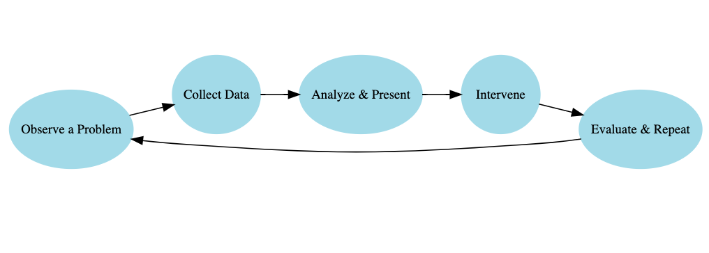
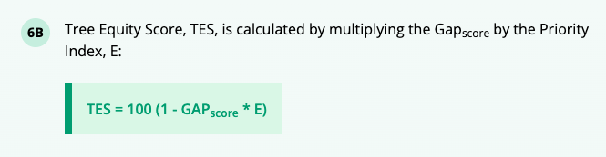
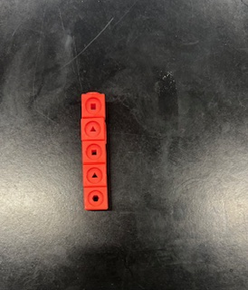
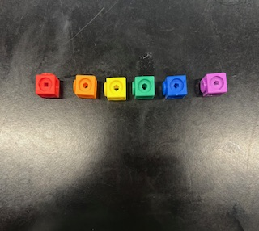
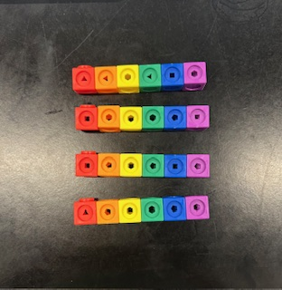

<a href="Tree_wrangling.txt" download = "Tree_wrangling.qmd" style="padding:10px 15px; background:#007ACC; color:white; text-decoration:none; border-radius:5px;">Download wrangling activity</a>

<a href="Tree_viz.txt" download = "Tree_viz.qmd" style="padding:10px 15px; background:#007ACC; color:white; text-decoration:none; border-radius:5px;">Download visualization activity</a>

<a href="TreeProject.txt" download = "TreeProject.qmd" style="padding:10px 15px; background:#007ACC; color:white; text-decoration:none; border-radius:5px;">Download project activity</a>

## What is data science and why urban planning?

-   **Key Idea:** Data science is about extracting insight from data to inform action.
-   **Focus** on applications of data science that connect to students interests
-   Ask students to add their own example of data science they've seen and why they suspect it to be data science.

Emphasis on Data science and Urban Planning as a cycle that is repetitive. There is always new data being collected and new solutions to be found. This opens up possibilities for limitless data exploration within the field which makes it an amazing introductory example of data science for beginner students.

## Tree coverage as a social issue

-   **Remember** This concept might be difficult for students to grasp. "How does the number of trees in my neighborhood affect me?"
-   **Ask** Students, "What does a tree do? What is its purpose" Answers might be "provides shade" or "creates oxygen." These are already good markers to highlight disparity but informing students of trees other functions and how trees in a community - or the lack thereof - can make a large difference in the well-being of the community members will help make the project feel relevant and impactful.

## Understanding the tree equity score

You can find the <a href = "https://www.treeequityscore.org/methodology" target = "_blank">methodology behind American Forests Tree Equity Research.</a>

-   The tree equity score underscores the need for tree planting in an area. Need or priority in a neighborhood is calculated by a number of factors that may highlight the potential for the area to be disproportionately affected by extreme heat, pollution, and other environmental hazards, which could be reduced with the benefits of trees.

## Foundational learning

DS4HS places a priority on shifting the narrative on data science and its accessibility. One of the main goals of this curriculum is to make content as tangible as possible for those with little to no experience in data or statistical analysis. We introduce key concepts in data science, and we endeavor to make sure the concepts are grasped as thoroughly as possible.

-   **Observation vs. Observational Unit:** Be explicit---each row is one observation, and the observational unit is the "thing" each row represents (e.g., a tree, a bus stop, a city block). In this example the "GEOID" represents one observational unit, a census block group of particular community or neighborhood in a given area that contains between 600 - 3,000 people.

-   **Ask:** "What does one row describe?" Have students answer in plain language.

-   **Variable Types:** Clarify the difference between categorical and numerical variables. Use color/highlight in your slides or board to mark a few examples from the dataset. Students often confuse column headers for variable values. Reinforce that variables are columns, values are entries in rows.

-   If possible, have students follow along in R to observe the data set. This can help them get used to the variable names and what a typical value looks like for a given variable.

## Mathlink Cubes

In every lesson, there is some sort of interactive portion to help students grasp the task of data wrangling through a physical simulation of the practice.

This example comes from an article in the Journal of Statistics and Data Science Learning [@mcgowan2025]. [Using Mathlink Cubes to Introduce Data Wrangling](https://www.tandfonline.com/doi/citedby/10.1080/26939169.2025.2485234?scroll=top&needAccess=true) helps to facilitate a tangible understanding of datasets and data manipulation. 

This example can also be replicated with paper strips and squares (though the creation of these materials may be tedious.)

- Hand out Mathlink Cubes to students in the form of "a dataset" meaning cubes are arranged in columns by color. Depending on the size of your data set(amount of rows), students will need that many blocks of a unique colored block for the mutate example.

The images below show the process of connecting the Mathlink cubes into a data-like structure that can be purposefully taken apart and reconstructed by students. 

**First,** connect one column vertically. 

**Next,** connect one row horizontally, anchored to the first cube in your column. 

Each subsequent row should then be connected **horizontally** and connected to a cube in the first column: 

**Finally,** reconstruct your first column vertically and you should be left with something like this: 

## Teaching tidyverse and ggplot

The worksheet below is intended to follow along with the **"Tree Equity Lesson"** lecture slides. The goal of an activity like this is to help students commit data wrangling and visualization strategies to memory and think bout the processes critically. 

<a href="TreeLesson_WS.pdf" download style="padding:10px 15px; background:#007ACC; color:white; text-decoration:none; border-radius:5px;">In-Class Data Wrangling Practice</a>

### Core Goals

- Students experience transforming a dataset using tidyverse data verbs 

- They start asking questions of the data: Who's impacted? Where? What relationships exist?

- Students see visualization as a tool for insight, not just graphics.

### Pedagogical Tips and Emphases

**1. Emphasize the "verbs" as actions**

- Anchor each function to a mental model:

  - `filter()` = "keep specific **rows**"

  - `select()` = "keep specific **columns**"

  - `mutate()` = "create new variables from existing ones"
  
  - `group_by()` = "hold data into baskets by value"
  
  - `summarize()` =  "collapse dataset into one row per item in group"

**2. Highlight data types when visualizing**

- **Categorical** → bar/column

- **Numeric** → histogram, scatter

- **Time-based** → line plot

- **Encourage asking:** *"What kind of variable is this? What would help uncover patterns?"*

**3. Don't skip reading outputs**

- Stop after each code chunk and ask: *"What changed? What does the output show?"*

- It is easy for students to focus on syntax and miss what the data is saying.

**4. Ask real-world connection questions**

- "What trend(s) do you notice?", "What might explain the relationship?", "What other variable might connect to the two variables already plotted?"

- Encourage students to answer questions in **plain** and **comfortable** language rather than expecting a more refined "data-science-y" answer. Practicing communicating will help bridge the gap between their common sense and trained data analysis.

## Student Exploration + Final Project

The project activity gives students the chance to apply everything they've learned from the lesson. It should feel open-ended and empowering, encouraging curiosity and creative problem-solving.

The data analysis can also become personal and meaningful: students choose their question, their variables, and their visualization. The instructor's role shifts from direct teaching to coaching and guiding students to sharpen questions, troubleshoot code, and draw clear, grounded conclusions. A presentation **template** for the project is provided below as a .qmd file. 

<a href="TreeProject.txt" download = "TreeProject.qmd" style="padding:10px 15px; background:#007ACC; color:white; text-decoration:none; border-radius:5px;">Download project activity</a>

### Group Work Guidance

Students should work in groups of 2–4, ideally with access to a shared computer.

**Encourage them to:**

  - Settle on a single state or two for a comparison they find interesting.

  - Write out a clear, answerable question, which may take several revisions.

**Students will use R (inside the RStudio IDE) to generate at least one graph and one statistical summary.**

Instructors or mentors should:

  - Circulate and offer help with debugging.

  - Ask clarifying questions to refine vague research questions.

  - *"What are you trying to compare? What variable would show that?"*

### Managing Student Presentations

**Each group should give a short (~3–4 min) presentation of:**

- research question / dataset
- data wrangling process
- plot(s) and the trends they suggest
- brief interpretation: *"What does this mean?"* and *"Why does it matter?"*

**While students present:**

- **Highlight** clarity of visualizations, originality of questions, or insightful interpretations.

- **Celebrate** one strong point from each group to model good data science communication.

  - For example, "What I loved about this presentation was how clearly the graphs were labeled — it helped us understand the patterns immediately."

