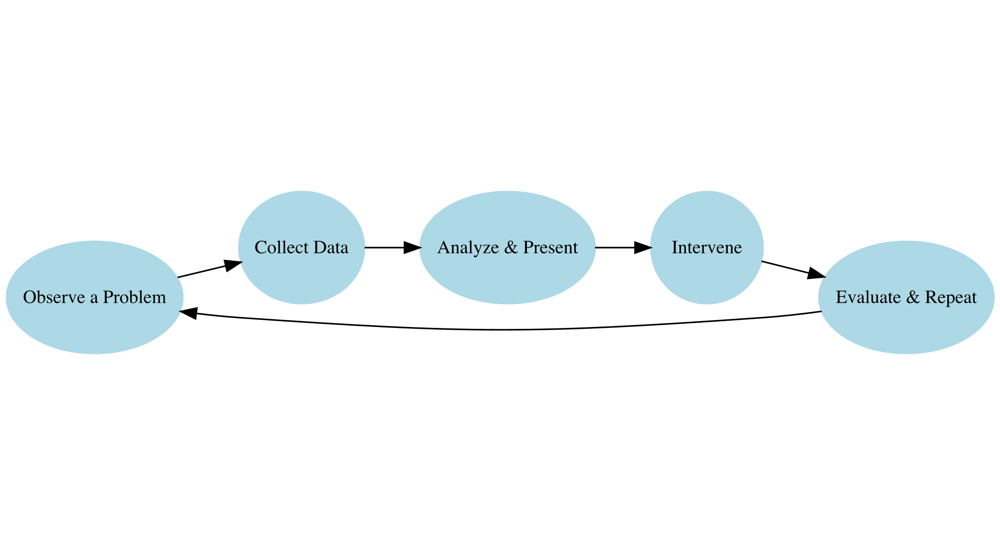
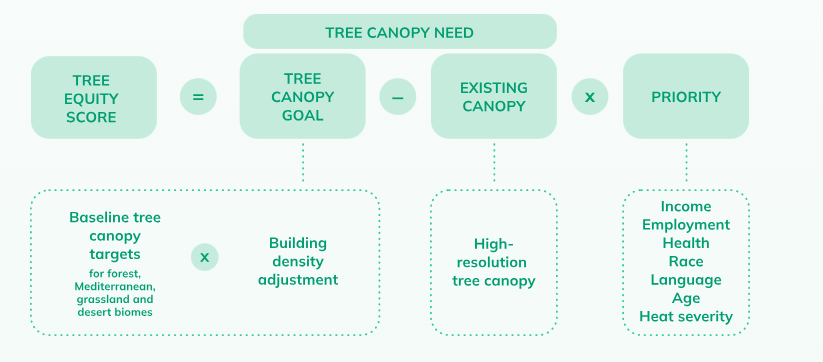
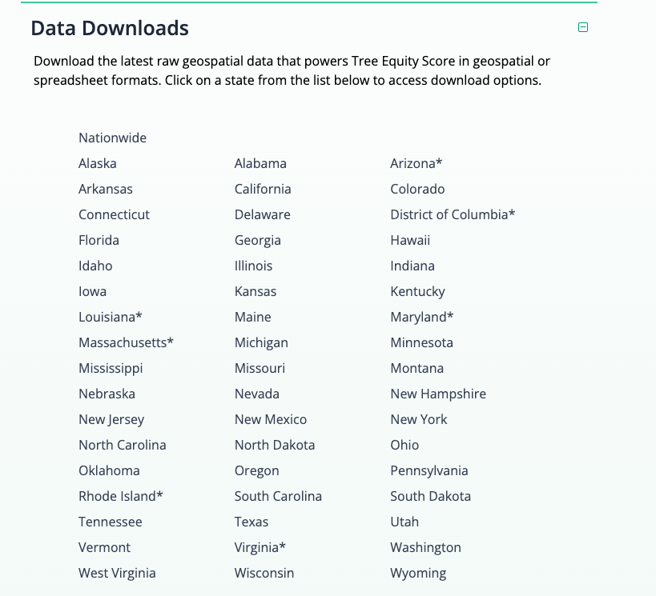

```{r}
#| include: false

options(pillar.width = 70)
library(tidyverse)
```

## 🌐 Why urban planning?

> Urban planning **IS** data science in action.

. . .

<div style="text-align: center;">

<h1>HOW??</h1>
</div>

## What is data science??

> Data science is the practice of "uncover[ing] actionable insights hidden in data. These insights can be used to guide decision making and strategic planning."^[https://www.ibm.com/think/topics/data-science]

. . .

**Examples:**

-   🎓 Schools study attendance and grade trends to identify students who may need extra support before they fall behind.
-   🏥 Hospitals use patient records and trends to predict who's at risk for certain illnesses --- helping doctors intervene earlier.

## DS cycle $\rightarrow$ urban planning cycle

```{r}
#| echo: false

library(DiagrammeR)
library(rsvg)

graph <- grViz("
  digraph cycle {
    graph [rankdir=LR]
    node [shape = ellipse, style=filled, color=lightblue, width=1, height=1, fontsize=12]

    Observe [label='Observe a Problem']
    Collect [label='Collect Data']
    Analyze [label='Analyze & Present']
    Intervene [label='Intervene']
    Evaluate [label='Evaluate & Repeat']

    Observe -> Collect -> Analyze -> Intervene -> Evaluate -> Observe
  }
")

graph %>%
  DiagrammeRsvg::export_svg() %>%
  charToRaw() %>%
  rsvg_png("cycle.png", width = 2200, height = 1200)



```

# 🌳 Introduction: Tree equity and city planning

- Tree planting is a direct action of city planning initiatives
    - *Why do some neighborhoods have fewer trees than others?* 
    - *How do trees affect neighborhoods?*
    - *How can we use data to understand the relationship between urban canopy and other variables?*

## Urban forests: Tree Equity Score

```{r}
#| out.width: '90%'
#| fig.align: center

```


-   Tree canopy coverage...
    -   improves air quality and stabilizes environmental hazards
    -   intercepts rainfall and prevents stormwater runoff
    -   reduces heat extremity improving peoples' physical and mental health

## Today's goals

-   Learn to use R for data analysis and communication
-   Understand what makes a dataset meaningful
-   Ask important questions about data and the observed world
-   Explore how data can inform **just** and **sustainable** practices


# Working with data

In order to process the tree equity data, we first need to learn how to **wrangle** the data!


## Data wrangling

As a first step, we need to **prepare** the data.

. . . 

**Data wrangling includes:**

-   Cleaning messy or incomplete data
-   Selecting the most relevant information
-   Reshaping data into a usable form
-   Creating new important variables

. . . 

Think of it like *organizing your workspace before starting a project*.

## MathLink cubes


## `filter()`: keep certain rows

`filter()` keeps only the rows that meet specific conditions.

```{r}
#| echo: true
#| eval: false

cubes |> 
  filter(red == "triangle")
```

. . . 


## MathLink cubes


## `select()`: keep certain columns

`select()` keeps only specified variables (columns).


```{r}
#| echo: true
#| eval: false

cubes |> 
  select(red, green)
```

. . . 


## MathLink cubes


## `mutate()`: add a new column

`mutate()` creates a new column (variable) by transforming existing ones.

```{r}
#| echo: true
#| eval: false

cubes |> 
  mutate(white = case_when(
    blue == "hexagon" ~ "square",
    blue != "hexagon" ~ "triangle")
    )
```

. . . 


## `arrange()`: ordering the rows

`arrange()` sorts the rows by the values of a variable (ascending or descending).

```{r}
#| echo: true
#| eval: false

# Hexagon → Square → Triangle → Pentagon.
cubes |> 
  arrange(purple)
```

. . . 


## `group_by()` and `summarize()`: summarizing by category

`group_by()` holds the rows in groups, specified by a particular variable.

`summarize()` collapses the rows so that there is **only one** row per group. A new variable is created to be the summary value.

```{r}
#| echo: true
#| eval: false

cubes |> 
  group_by(yellow) |> 
  summarize(count = n())
```

. . . 


## A Look at the data

### California tree coverage data [^1]

[^1]: Tree Equity Score. 2023. American Forests. https://www.treeequityscore.org/

```{r}
ca_tes <- readr::read_csv("ca_csv/ca_tes.csv")

gt::gt(
  head(ca_tes)) |> 
  gt::fmt_number(decimals = 2)
```

Variable descriptions are given (mostly) at https://www.treeequityscore.org/methodology?tab=data-glossary


## An observation

> Observational Unit: object by which data is collected and analyzed

For example, an observational unit could be any of the following:

-   Person

-   County

-   State

-   Country

. . .

-   *What is the observational unit in the tree equity dataset?*

## What is the observational unit?

```{r}
gt::gt(
  head(ca_tes)) |> 
  gt::fmt_number(decimals = 2)
```

-   The GEOID or Census block Group describes a particular community or neighborhood in a given area contains between 600 - 3,000 people [^2]

[^2]: American Forests Methods and Data Glossary. https://www.treeequityscore.org/methodology?tab=data-glossary

## What are the variables?

-   `treecanopy`: actual tree coverage in an area
-   `tc_goal`: ideal tree coverage based on needs
-   `tc_gap`: how far behind the area is (`tc_goal` - `treecanopy`)
-   `pctpocnorm`: % residents who are people of color
-   `pctpovnorm`, `unemplnorm`: indicators of equity
-   `lingnorm`: % of non-English households (linguistic isolation)
-   `tes`: tree equity score (gap × need)

<!--
## What do we want to know

-   **Its not always easy to start analyzing large data sets, which is why it is important to ask SMART questions**
-   **S**pecific: clear, detailed, and not too broad
-   **M**easureable: can be answered using the available data
-   **A**pplicable: tied to real-world meaningful contexts
-   **R**easoned: based on logic or a thoughtful assumption
-   **T**estable: can be analyzed to reveal patterns or relationships

## SMART vs. Not-so-SMART questions

**Don't ask:**

-   Is "given neighborhood" affected?
-   Does tree coverage matter?

. . . 

**Instead ask:**

-   *How does tree coverage relate to income in LA neighborhoods?*
-   *Is the tree coverage gap higher in areas with high unemployment?*

# Going From Question to Answer

-->

## Wrangling the tree data!

## 1. Keep certain rows

> Show only neighborhoods with low tree equity scores (`tes` $<$ 50).

-   Hint: `filter()`

. . .


```{r}
#| echo: true
#| eval: true

ca_tes|>
  filter(tes < 50)
```


## 2. Keep certain columns

> Focus on `treecanopy`, `tes`, and `unemplnorm` (keep only those columns).

-   Hint: `select()`

. . .


```{r}
#| echo: true
#| eval: true

ca_tes |>
  select(treecanopy, tes, unemplnorm)
```


## 3. Create a new variable

> What percent of the tree coverage goal has been met?

-   Hint: `mutate()`

```{r}
ca_tes |> 
  select(GEOID, place, state, treecanopy, tc_goal)
```


## 3. Create a new variable

> What percent of the tree coverage goal has been met?

-   Hint: `mutate()`

. . .


```{r}
#| echo: true
#| eval: true

ca_tes |>
  mutate(pct_coverage_met = treecanopy / tc_goal * 100) |> 
  select(GEOID, place, state, treecanopy, tc_goal, pct_coverage_met)
```

## 4. Collapse the rows by values of a group

> Compute the average `tes` score by `place`

-   Hint: `group_by()` and `summarise()`

. . . 


```{r}
#| echo: true
#| eval: true

ca_tes |>
  group_by(place) |>
  summarize(avg_tes = mean(tes, na.rm = TRUE))
```


## 5. Which neighborhoods have the greatest tree equity need?

> Use only the variables `GEOID`, `place`, and `tes`.

**Hint:** Use `arrange()`

. . . 


```{r}
#| echo: true
#| eval: true

ca_tes |>
  select(GEOID, place, tes) |>
  arrange(tes)
```


## 6. How does tree equity relate to both poverty and health disparity?

- create variable `combined_index` that connects `pctpovnorm` and `health_nor` as a product
- cut data set down to desired variables (`place`, `combined_index`, and `tes`)
- organize data to see which places have highest combined index

**Hint:** to sort *descending*, you'll need to use `desc()` *within* the `arrange()` function.

. . .

```{r}
#| echo: true
#| eval: true

ca_tes |>
  mutate(combined_index = pctpov * health_nor) |>
  select(place, combined_index, tes) |>
  arrange(desc(combined_index))

```


# Visualizing the data


## What and why

-   Data visualization is the process of transforming raw data into visual formats, like **charts**, **graphs**, or **maps**, to make it easier to understand and interpret

-   Communicate Results **Clearly** and **Effectively**

-   Supports evidence-based decisions in fields like:

    -   Public health
    -   Climate research
    -   Urban planning
    -   Business & marketing

## What is **ggplot2**?

-   **ggplot2** is an R package for data visualization
-   Encoded functions for numerous different plot types
-   Builds plots in layers using +

## Basic structure of a ggplot

```{r}
#| echo: true
#| eval: false
#| code-line-numbers: "2|3|4|5"

# General structure
data |>
  ggplot(aes(x = ..., y = ...)) +
  geom_function() +
  labs("label for you plot and axes")
      
```

## Common `geom()` functions

-   geom_point(): scatter plot (x vs y)
-   geom_bar(): bar charts (**categorical** data)
-   geom_col(): bar chart with height from y variable (**categorical** data)
-   geom_histogram(): distribution of numeric variable
-   geom_line(): connect the dots across (x,y) coordinates

## Which plot should I use?

::: {.small}

| variable type   | plot type    | `geom()`?    | when to use   |
|-----------------|----------------|----------------|-----------|
| Categorical             | bar chart    | `geom_bar()`       | Count frequency of categories      |
| Numeric                 | histogram    | `geom_histogram()` | Show distribution of one variables |
| Either + Either         | scatter plot | `geom_point()`     | Explore relationships between vars |
| Numeric + Either        | line chart   | `geom_line()`      | Show change over x-variable        |
| Category + Value        | column chart | `geom_col()`       | Compare totals across categories   |

:::

## Types of variables

-   insert graphic on variable types

## Tree Equity vs. Poverty

> Is there a relationship between poverty and tree equity?

. . . 


```{r}
#| echo: true
#| eval: true
#| code-line-numbers: "1|2|3|4|5|6"

ca_tes|>
  ggplot(aes(x = pctpov, y = tes)) +
  geom_point(color = "green") + 
  labs(title = "Tree Equity vs. Poverty",
       x = "Percent in Poverty",
       y = "Tree Equity Score")
```

## Distribution of Tree Equity Scores

> How many places have each Tree equity score? 

. . . 


```{r}
#| echo: true
#| eval: true
#| code-line-numbers: "1|2|3|4|5|6"

ca_tes|>
  ggplot(aes(x = tes)) +
  geom_histogram(bins = 15, fill = "red") +
  labs(title = "Distribution of Tree Equity Scores",
       x = "Tree Equity Score",
       y = "Number of Places")

```

## Tree equity vs. linguistic isolation

> Is there a relationship between linnguistic isolation(`lingnorm`) and `tes` in an area. 

  - Use ggplot to plot the relationship between `tes` and `lingnorm`
  - Choose the **best** plot for the variable types
  - Create fitting labels for your axes and plot title

##

```{r}
#| echo: true
#| eval: true
#| #| code-line-numbers: "1|2|3|4|5|6"

ca_tes|>
  ggplot(aes(x = lingnorm, y = tes)) +
  geom_point(color = "turquoise") + 
  labs(title = "Tree Equity vs. Linguistiv Isolation",
       x = "Percent in Linguistic Isolation",
       y = "Tree Equity Score")
```

# Explore, Analyze, Present!


## Your turn 

> You will work in small groups to investigate tree equity in a new state(s) 

-   **Each Group Will: **   
  -   Choose a research question(s)    
  -   Use tidyverse tools to explore the data     
  -   Create plot(s) with ggplot2     
  -   Present findings to the class 

## Your goals  

-   Clearly state your research question  
-   Support it with r code and graphs  
-   Use the data to identify a trend, pattern, or disparity  
-   Communicate **WHY** it matters 

## Sample questions

-   How does tree canopy vary across different neighborhoods in *chosen state*?  
-   Is there a relationship between percent in poverty and tree equity score in *chosen state*? 
-   How do tree equity trends compare between two or more *chosen states*?  
-   Are places with lower tree equity also more likely to have higher health disparities in *chosen state*?  

## Getting the data 

**Navigate to https://www.treeequityscore.org/:**

-   in drop down menu, click the "methods and data" tab 
-   choose the "data download" page; you should see something like: 

. . .  

{ width=500px}


- by right-clicking on a state, you can get the URL, something like the following: https://tes-app-data-share.s3.amazonaws.com/nc/nc_csv.zip

- you may need to run the code below one line at a time to see what needs adjusting for your choice of state (likely you will **only** need to adjust the two digit state abbreviation).

## Uploading your own state data

```{r}
#| echo: true
#| eval: true

# Example code to load your state data
tmp <- tempfile(fileext = ".zip")
nc_data_zip <- download.file("https://tes-app-data-share.s3.amazonaws.com/nc/nc_csv.zip", 
                             tmp, mode = "wb")

unzip(tmp, list = TRUE)

nc_tes <- readr::read_csv(unz(tmp, "nc_tes.csv"))

head(nc_tes)
```